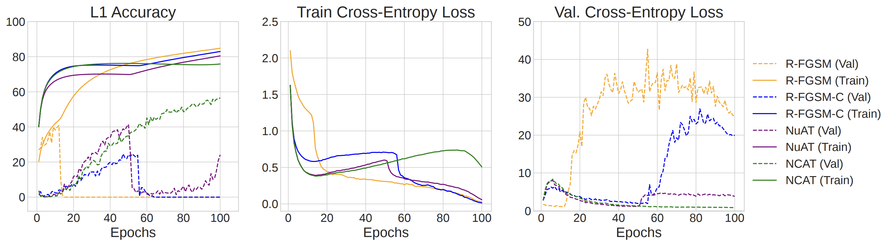
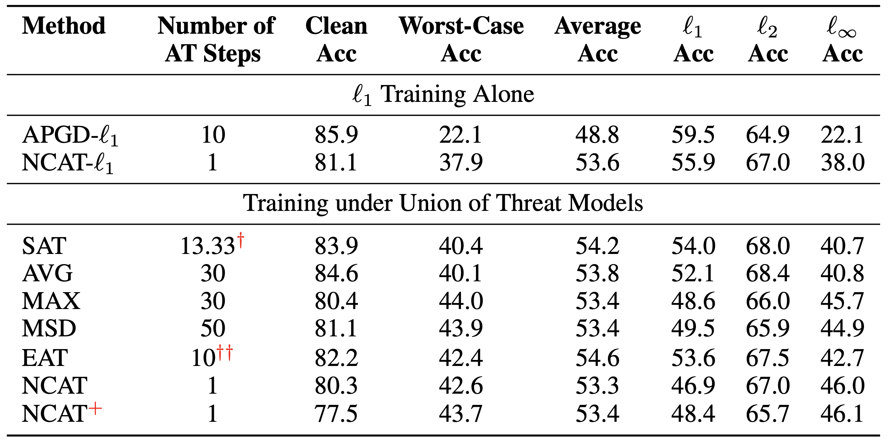

# Toward Efficient Robust Training against Union of $\ell_p$ Threat Models

This repository contains code for the implementation of our NeurIPS 2022 paper [Toward Efficient Robust Training against Union of Lp Threat Models](https://openreview.net/forum?id=6qdUJblMHqy). 

Recording for the NeurIPS Virtual Conference: [[video](https://neurips.cc/virtual/2022/poster/52908)]

In-person Presentation media: [[poster](https://nips.cc/media/PosterPDFs/NeurIPS%202022/52908.png?t=1669611544.5970736)]

To summarize, we make the following contributions in this paper:
- We demonstrate the first successful single-step robust training procedure, NCAT-$\ell_1$, to
achieve $\ell_1$ robustness by using a curriculum schedule with Nuclear Norm based training.
- We extend this approach to propose a training procedure NCAT, that yields SOTA-like robust
accuracy under the union of multiple $\ell_p$ threat models, while requiring only a single-step
attack budget per minibatch.
- We further demonstrate that the proposed defense can scale-up to high-capacity networks and
large-scale datasets such as ImageNet-100. Additionally, NCAT trained models generalize
to unseen threat models, achieving near-SOTA robustness even on Perceptual Projected
Gradient Descent (PPGD), which comprises one of the strongest attacks known to date.


## NCAT: Nuclear Curriculum Adversarial Training (NCAT)
In this work, we develop an efficient adversarial training procedure, NCAT, to train networks that are robust against a union of $\ell_p$ threat models, namely $\ell_{\infty}$, $\ell_2$ and $\ell_1$. To do so, we first focus on developing an efficient, yet effective robust training procedure for the $\ell_1$ threat model:

- Key Observation: Setting up a curriculum for adversarial perturbations greatly improves overall stability, especially in sensitive $\ell_1$ based training
- However, RFGSM-AT with curriculum only leads to a delay in catastrophic failure; R-FGSM adversaries are not quite suitable for robust training

<p align="center">
    
</p>

**Catastrophic Overfitting in $\ell_1$ Adversarial Training:** To analyze the stability of single-step training, we plot accuracy (left) and cross-entropy losses (centre, right) over epochs of different single-step adversarially trained models as shown above. With R-FGSM based adversarial training, catastrophic overfitting occurs with extreme gradient masking (orange); adversarial accuracy (loss) is high (low) on the train set, while being close to zero (high) for validation images. More so, even using a curriculum schedule for $\ell_1$ adversaries during training only delays the catastrophic overfitting (blue). In contrast, the proposed training approach NCAT (green) does not display catastrophic overfitting due to gradient masking, and is stable over the entire training regime.


**NCAT:** While pointwise loss minimization is susceptible to catastrophic failure, enforcing local function smoothness with a curriculum schedule enables the first successful demonstration of single-step training against $\ell_1$ adversaries. Furthermore, we extend the proposed method to achieve worst-case robustness under multiple $\ell_p$ norm constraints simultaneously.

Trained model checkpoints can be found [here](https://drive.google.com/drive/folders/1mSOEzc_Yz1IyqTnOqTuLCWL4wjpGSucJ?usp=sharing).


## Summarized Results on CIFAR-10
Here we present a brief summary of results on the CIFAR-10 dataset obatined on using the ResNet-18 architecture. For more details, please refer to the main [paper](https://openreview.net/forum?id=6qdUJblMHqy). Robust evaluations are presented under the constraint sets given by the $\ell_1$ ball of radius $12$, $\ell_2$ ball of radius $0.5$ and $\ell_{\infty}$ ball of radius $8/255$ comprising the individual threat models of interest, along with worst-case and average-case performance under the union of these threat models.


<p align="center">
    
</p>

## Citing this Work
```
@inproceedings{
sriramanan2022toward,
title={Toward Efficient Robust Training against Union of \${\textbackslash}ell\_p\$ Threat Models},
author={Gaurang Sriramanan and Maharshi Gor and Soheil Feizi},
booktitle={Advances in Neural Information Processing Systems},
editor={Alice H. Oh and Alekh Agarwal and Danielle Belgrave and Kyunghyun Cho},
year={2022},
url={https://openreview.net/forum?id=6qdUJblMHqy}
}
```
